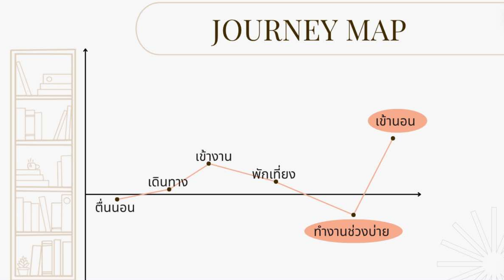
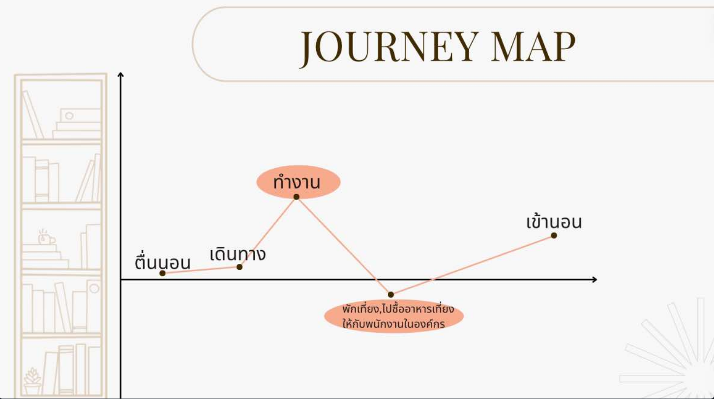
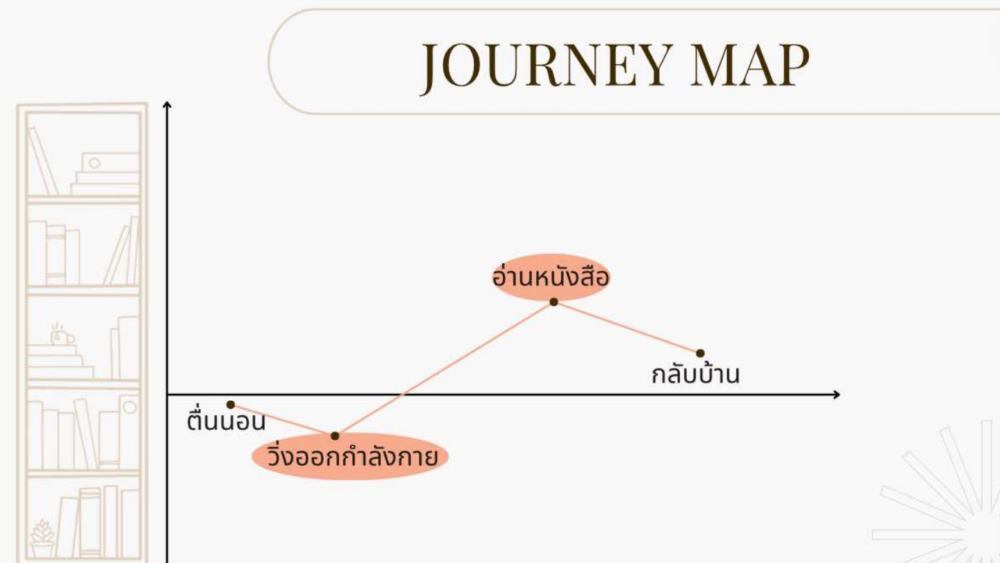

# JOURNEY MAP
### Bo

* เช้า : พี่โบ้ตื่นนอน แล้วเดินทางออกจากบ้านเพื่อไปทำงานที่ห้องสมุดเพื่อการเรียนรู่ทุ่งครุ่
* บ่าย : พี่โบ้ได้พักเที่ยงกินข้าว แล้วกลับมาทำงานในช่วงบ่ายต่อ
* เย็น : พี่โบ้เลิกงงาน เดินทางกลับบ้าน แล้วเข้านอน

### Pha

* เช้า : ป้าภาตื่นนอน แล้วเดินทางออกจากบ้านเพื่อไปทำงานที่ห้องสมุดเพื่อการเรียนรู่ทุ่งครุ่
* บ่าย : ป้าภาได้พักเที่ยงกินข้าว และซื้ออาหารเที่ยงให้กับพนักงานในองค์กร
* เย็น : ป้าภาเลิกงงาน เดินทางกลับบ้าน แล้วเข้านอน

### Tee

* เช้า : ลุงธีตื่นนอน แล้วไปวิ่งออกกำลังกายที่สวนธน
* บ่าย : หลังจากวิ่งเสร็จ ลุงธีก็มานั่งพักอ่านหนังสือที่ห้องสมุดเพื่อการเรียนรู้ทุ่งครุ่
* เย็น : อ่านหนังสือเสร็จลุงธีก็กลับบ้าน
